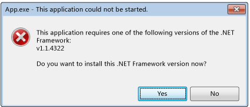
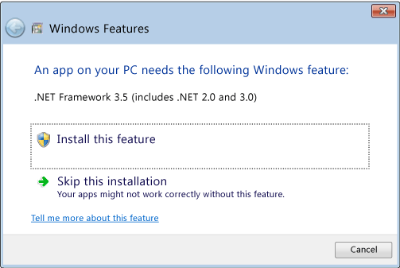

## 背景

**托管公共语言运行时**(CLR)的所有应用程序都必须启动（或激活）CLR，才能运行托管代码。通常，.NET Framework应用在生成它的CLR版本上运行，但你可以使用应用程序配置文件（有时称为app.config文件）来更改桌面应用程序的此行为。

如果CLR激活系统无法加载应用程序所需运行时的正确版本，它将向用户显示一条错误消息，通知他们，他们的计算机未正确配置，无法运行该应用程序，并为他们提供机会来修复该问题。在此情况下通常会显示以下错误消息。用户可以选择“是”以转到Microsoft网站，从中为应用程序下载正确的.NETFramework版本。

> 若要解决根本问题并提供最佳用户体验（更少错误消息），建议执行以下操作：

- 对于.NET Framework 3.5（和更低版本）应用程序：**将应用程序配置为支持.NET Framework 4或更高版本**。
- 对于.NET Framework 4应用程序：**安装.NET Framework 4可再发行组件包，作为应用程序安装的一部分**。

> Windows 8/10/11行为和UI

CLR激活系统在Windows 8/10/11上提供与在其他版本Windows操作系统上一样的行为和UI，除非加载CLR 2.0时遇到问题。Windows 8包括使用CLR 4.5的.NET Framework 4.5。但是，Windows 8不包括.NET Framework 2.0、3.0或3.5，它们都使用CLR 2.0。结果，依赖于CLR 2.0的应用程序默认情况下在Windows 8上不运行。相反，它们将显示下面的对话框，使用户能够安装.NET Framework 3.5。用户还可在“控制面板”中启用.NET Framework 3.5。

安装.NET Framework 3.5后，用户可以在其Windows8计算机上运行依赖于.NET Framework 2.0、3.0或3.5的应用程序。他们还可以运行.NET Framework 1.0和1.1应用程序，前提是这些应用程序未显式配置为仅在.NET Framework 1.0或1.1版上运行。

## 相关文章

* [遇见最美Windows 11之现代Windows桌面应用开发 - 探索.Net framework和CLR版本关系](https://www.cnblogs.com/taylorshi/p/15768620.html)